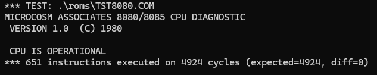
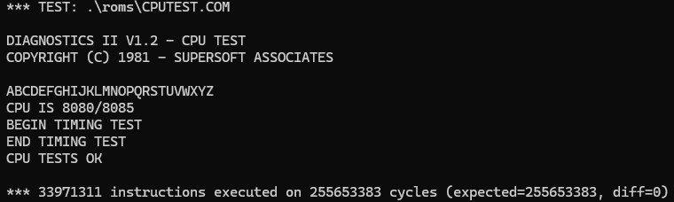
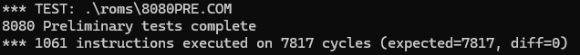
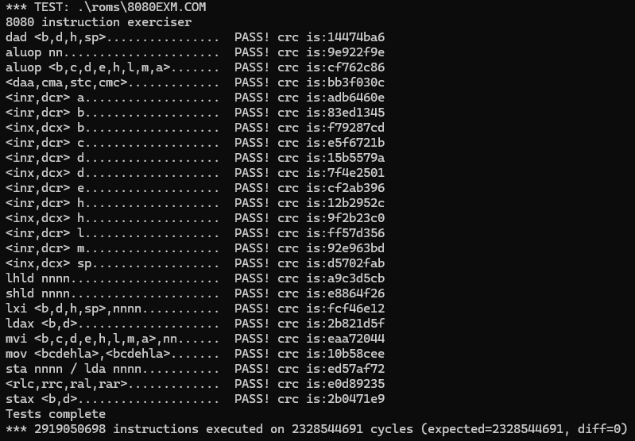

# A Simple i8080 Emulator
---

This is an emulator I am writting in C++ to emulate the Intel 8080 CPU. 
This project is as an update for an older 8080 emulator I wrote before I was a CS student.
My intention is to build an emulator that will run the ROM files for the original Space Invaders Arcade Cabinet.

To run this project, you will need a coy of the SDL2 library. I will use this library to render the game to  a window and handle keyboard events.
I am compiling this using the C++20 standard to gain access to the <format.h> library.

---
# Test ROM Results


In researching for this project, I found that there are four common test ROMs that are used to benchmark an i8080 CPU emulator. 
Because I am not running an instance of the CP/M operating system, I had to inject 2 opcodes into system memory at specific reset vectors:


<ul>
	<li>OUT, 0 is injected at $0000 to halt the cpu, signaling the end of a test</li>
	<li>OUT, 1 is injected at $0005 to allow the ROM to print data to the terminal</li>
</ul>

</br>

### Test ROM Setup - This code is added just after the ROM file is loaded into memory

```
// Set PC to program start
c->PC = 0x0100;

// inject "out 0,a" at 0x0000 (signal to stop the test)
c->memory[ 0x0000 ] = 0xD3;
c->memory[ 0x0001 ] = 0x00;

// inject "out 1,a" at 0x0005 (signal to output some characters)
c->memory[ 0x0005 ] = 0xD3;
c->memory[ 0x0006 ] = 0x01;
c->memory[ 0x0007 ] = 0xC9;
```

</br>

### Output from TST8080.COM ROM File



</br>

### Output from CPUTEST.COM ROM File



</br>

### Output from 8080PRE.COM ROM File




</br>

### Output from 8080EXM.COM ROM File



</br>

# Space Invaders!

### I will update this section when I get Space Invaders running